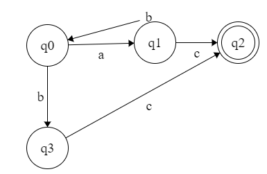
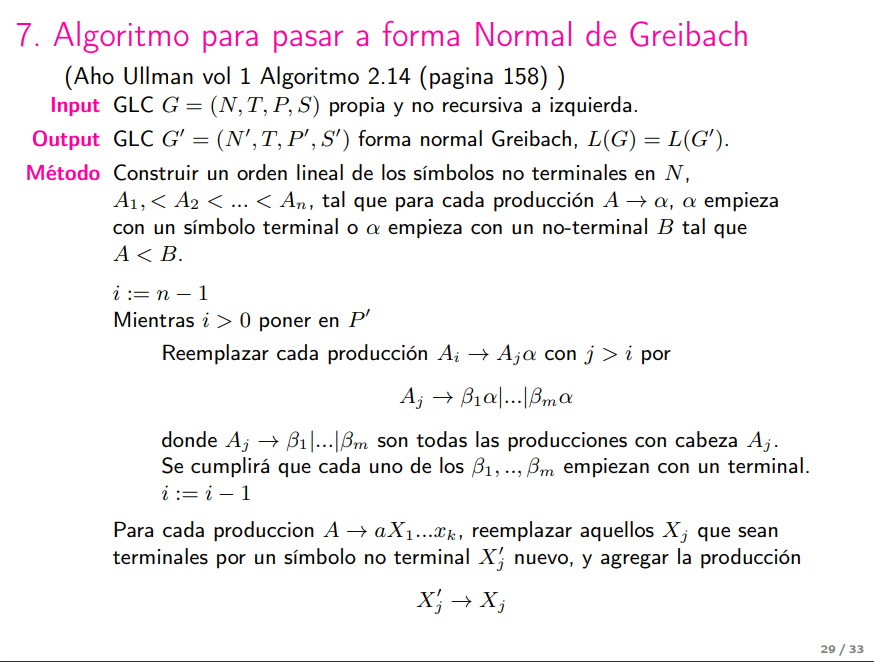

# Ejercicios de práctica

## Ejercicio 1

Dar un algoritmo que decida si dos expresiones regulares denotan el mismo lenguaje. Justificar la correctitud. Analizar la complejidad computacional de peor caso.

### Opción 1

Sea $r_1$ y $r_2$ dos expresiones regulares. Construir un **AFND** $M_1$ que acepte $L(r_1)$ y un **AFND** $M_2$ que acepte $L(r_2)$. Luego, determinizar $M_1$ y $M_2$ para obtener $M_1'$ y $M_2'$, respectivamente. Finalmente, minimizar $M_1'$ y $M_2'$ para obtener $M_1''$ y $M_2''$, respectivamente. Si $M_1''$ y $M_2''$ son isomorfos, entonces $L(r_1) = L(r_2)$.

Como está explicado en el resumen, el tamaño de un autómata construido a partir de una expresión regular está acotado por el doble del tamaño de dicha expresión. Luego, $Q_1 <= 2|r_1|$ y $Q_2 <= 2|r_2|$. Por lo tanto, la complejidad temporal de la construcción de los autómatas es $O(max\{|r_1|, |r_2|\})$. Por otro lado, es necesario determinizarlos, lo que conlleva una complejidad de $O(max{2^{|r_1|}, 2^{|r_2|}})$. Finalmente, hay que minimizarlos, lo que conlleva una complejidad de ???. Chequear el isomorfismo de grafos tiene una complejidad menor o igual a una exponencial en el tamaño de los grafos, por lo que no modifica la complejidad total del algoritmo.

Complejidad total: $O(max\{2^{|r_1|}, 2^{|r_2|}\})$

### Opción 2

Sea $r_1$ y $r_2$ dos expresiones regulares. Construir un **AFND** $M_1$ que acepte $L(r_1)$, y un **AFND** $M_2$ que acepte $L(r_2)$. Luego, determinizar $M_1$ y $M_2$ para obtener $M_1'$ y $M_2'$, respectivamente. Luego, obtener el complemento de $M_1'$, $M_1''$, y el complemento de $M_2'$, $M_2''$. Ahora, utilizando operaciones sobre autómatas, obtener el autómata $M_3$ que acepte $L(r_1) \triangle L(r_2)$, es decir, la diferencia simétrica de los lenguajes (ésta se puede obtener como $(L(r_1) \cup L(r_2)) \cap ((L(r_1))^c \cap (L(r_2))^c)$). Finalmente, determinizar $M_3$ para obtener $M_3'$, y chequear si $M_3'$ es vacío. Si es vacío, entonces $L(r_1) = L(r_2)$.

Para chequear si $M_3'$ es vacío, se puede utilizar el algoritmo de búsqueda en profundidad (DFS) para recorrer el grafo del autómata. Si se llega a un estado final, entonces el autómata no es vacío. Si se recorren todos los estados y no se llega a un estado final, entonces el autómata es vacío.

Por un análisis similar, la complejidad temporal de este algoritmo es $O(max\{2^{|r_1|}, 2^{|r_2|}\})$. Sin embargo, este algoritmo probablemente sea más eficiente que el anterior, ya que no es necesario minimizar los autómatas y chequear que sean isomorfos. La complejiad de chequear que un autómata sea vacío es $O(máx\{|r_1|, |r_2|\} * |\Sigma_1\cup\Sigma_2|)$

### Opción 2 bis

Podemos utilizar el lema de pumping para decidir si un lenguaje es vacío. $L(M) \neq \varnothing \iff \exists w \in L(M) \wedge |w| \lt n$.

$\Leftarrow$) Trivial, si existe una palabra de longitud menor a $n$ entonces el lenguaje no es vacío.

$\Rightarrow$) Supongamos que no existe palabra menor a $n$. Tomo la palabra mas corta $w$, que por suposicion es mayor o igual a $n$. Sin embargo, si es mayor o igual a $n$, por el lema de pumping, puedo descomponerla en $xyz$ con $|xy| \leq n$ y $|y| \gt 0$. Por lo tanto $xy^iz \in L(M)$ para todo $i \geq 0$, mas aún $xy^0z \in L(M).$ Entonces, $xy^0z$ tiene longitud menor a $w$. Pero dijimos que $w$ era la palabra mas corta, llegamos a un absurdo.

Por lo tanto para ver si el lenguaje es vacío, basta con fijarse si alguna palabra menor a $n$ esta en el lenguaje.

TODO: COMPLEJIDAD

la complejidad va a estar definida por:

- minimizar el autómata
- probar palabras menores a $n$?????

## Ejercicio 2

Demostrar que dada una una gramática libre de contexto $G$ sin símbolos inútiles y no recursiva a derecha. Existe una constante $c$ tal que que para todo par de símbolos no terminales $A$, $B$ para toda cadena de terminales $w$ y para toda cadena de terminales y no terminales $\alpha$, si $A\ \underset{R}{\stackrel{i}{\Rightarrow}}\ \alpha Bw$, entonces $i \leq c^{|w|+2}$.

### Solución

Es literal la demo de la cota para el árbol de derivación pero con $R$ en vez de $L$.

## Ejercicio 3

Dar dos algoritmos distintos para determinar si el lenguaje aceptado por un autómata finito dado es el conjunto de todas las cadenas del alfabeto. Justificar cada uno y dar su complejidad algorítmica.

### Opción 1

Sea $M = \langle Q, \Sigma, \delta, q_0, F \rangle$ un **AF**. Construir un **AFD** $M' = \langle Q, \Sigma, \delta', q_0, F' \rangle$ que acepte $\Sigma^*$ y sea mínimo. Luego, determinizar y minimizar $M$ para obtener $M''$. Si $M'$ es isomorfo a $M''$, entonces $L(M) = \Sigma^*$.

En cuanto a la complejidad computacional, será necesario construir un **AFD** que acepte $\Sigma^*$, lo que conlleva una complejidad muy baja además es mínimo de una (check) (capaz calcular?). Luego, determinizar y minimizar $M$ tiene costo $O(2^n)$ y chequear si $M$ y $M'$ son isomorfos tiene costo $O(2^n)$ (aprox).

Complejidad total: $O(2^n)$

### Opción 2

Sea $M = \langle Q, \Sigma, \delta, q_0, F \rangle$ un **AF**. Determinizarlo, obteniendo $M'$ y construir el complemento de $M'$, $M''$. Luego, si $M''$ es vacío, entonces $L(M) = \Sigma^*$

En cuanto a la complejidad computacional, será necesario determinizar $M$, lo que conlleva una complejidad de $O(2^n)$. Luego, construir el complemento de $M'$ tiene una complejidad de $O(n)$. Finalmente, chequear si $M''$ es vacío tiene una complejidad de $O(ns)$ (es DFS en el grafo).

## Ejercicio 4

Dar un algoritmo que determine si un lenguaje regular dado es infinito. Justificar y dar la complejidad del algoritmo en el peor caso.

### Opción 1

Armo un **AFND-$\lambda$** $M$ que acepte el lenguaje. Luego busco un ciclo en el grafo de $M$ utilizando DFS. Si encuentro un ciclo y no todas las transiciones son $\lambda$, entonces el lenguaje es infinito. Si no encuentro un ciclo, entonces el lenguaje es finito.

Si asumimos que nos dan como entrada una expresión regular, entonces la complejidad temporal del algoritmo depende de:

- Construir el **AFND-$\lambda$** $M$ a partir de la expresión regular. Esto tiene una complejidad de $O(|r|)$.
- Buscar un ciclo en el grafo de $M$ utilizando DFS. Esto tiene una complejidad de $O(ns)$.

### Opción 2

Usar el lema de pumping para lenguajes regulares. No entiendo bien esto.

$L(M)$ es infinito $\Longleftrightarrow$ $\exists w \in L(M)$ con $n \leq |w| \lt 2n$

$\Rightarrow$) Supongamos que no hay en ese rango. Si es infinito tiene que haber una palabra mayor a $2n$ que se puede descomponer en $xyz$ con $|xy| \leq n$ y $|y| \gt 0$. Por lo tanto $xy^iz \in L(M)$ para todo $i \geq 0$, mas aún $xy^0z \in L(M).$ Si $xy^0z$ tiene longitud menor a $2n$ llegamos a un absurdo. Si tiene longitud mayor a $2n$ podemos volver a hacer el mismo razonamiento hasta llegar al rango (tener en cuenta que no podemos pasarnos del rango porque $|xy| \leq n$).

$\Leftarrow$) Como $w$ es mayor a $n$ se puede descomponer y bombearla infinitamente.

Entonces busco una palabra $w$ entre $n$ y $2n$. Si existe el lenguaje es infinito. Si no existe el lenguaje es finito.

## Ejercicio 5

1. ¿Cuántos autómatas finitos determinísticos con dos estados pueden construirse sobre el alfabeto $\{0, 1\}$?
2. ¿Cuántos autómatas finitos no determinísticos con dos estados pueden construirse sobre el alfabeto $\{0, 1\}$?
3. ¿Cuántos autómatas de pila con dos estados pueden construirse con alfabeto de entrada $A$, alfabeto de pila $Z$, y una cantidad máxima $M$ de símbolos en cada transición?

### Solución

1. - $|Q| = 2$
   - $|\Sigma| = 2$
   - $|\delta| = |Q|^{|Q|*|\Sigma|} = 2^4 = 16$
   - $|F| = 2^{|Q|} = 2^2 = 4$
   - $|q_0| = 2$
   - Entonces, $16 \cdot 4 \cdot 2 = 128$.
2. - $|Q| = 2$
   - $|\Sigma| = 2$
   - $|\delta| = 2^{|Q|^2*|\Sigma|} = 2^8 = 256$
   - $|F| = 2^{|Q|} = 2^2 = 4$
   - $|q_0| = 2$
   - Entonces, $256 \cdot 4 \cdot 2 = 2048$.
3. TODO: completar

## Ejercicio 6

1. Fijados los alfabetos $\Delta$ y $\Gamma$, ¿Cuántos autómatas de pila distintos $\langle Q, \Sigma, \Delta, \Gamma, q_0, F \rangle$ determinístiscos hay, Si $Q$ tiene 5 estados y en cada transición se escriben en la pila 0, 1 o 2 símbolos?

2. ¿Y cuántos no determinísticos?

### Solución

TODO: completar

## Ejercicio 7

Dar la definición de gramática libre de contexto recursiva a derecha. Dar un ejemplo. Dar el algoritmo de eliminación de recursión a derecha (inmediata y no inmediata), su justificación de correctitud, y su complejidad computacional.

### Definición

Sea $G = \langle N, \Sigma, P, S \rangle$ una gramática libre de contexto. Decimos que $G$ es recursiva a derecha si existe un no-terminal $A \in N$ y una cadena $w \in \Sigma^*$ tales que $A \underset{R}{\stackrel{*}{\Rightarrow}}wA$.

### Ejemplos

- $A \rightarrow aA\ |\ b$

Podemos ver que A es recursiva a derecha, ya que $A \Rightarrow aA \Rightarrow aaA \Rightarrow aaaA \Rightarrow ... \Rightarrow a^nA$. En este caso, se produce una recursión a derecha inmediata.

- $A \rightarrow aB$
- $B \rightarrow aA\ |\ b$

Podemos ver que A es recursiva a derecha, ya que $A \Rightarrow aB \Rightarrow aaA \Rightarrow aaaB \Rightarrow aaaaA \Rightarrow ... \Rightarrow a^nB$. En este caso, se produce una recursión a derecha no inmediata.

### Algoritmo de eliminación de recursión a derecha

- Para sacar la recursión a derecha inmediata tengo que pasar las producciones de la forma:
  - $A \rightarrow \alpha A |\ βA |\ \sigma_1 |\ \sigma_2$

   a la forma:

  - $A \rightarrow B \sigma_1\ |\ B \sigma_2$
  - $B \rightarrow B \alpha \ |\ B β \ |\ \alpha \ |\ β$

   Esto hace que el arbol en vez de recursivo a derecha sea a izquierda. La idea intuitiva es que primero fija el ultimo terminal y despues va recursivamente para atras.

- La idea para sacar la recursión a derecha no inmediata es poner un orden entre los símbolos terminales y en cada paso resolvemos un símbolo (del principio al final) donde cada producción tiene que terminar con un terminal o no terminal mayor a él.

   ```pseudo
   para i = 1 hasta n
      para j = 1 hasta i-1
         si (A_i -> α  A_j y Aj -> β_1 | ... | β_n) ∈ P
            Reemplazar A_i -> α  A_j por A_i -> α  β_1 | ... | α  β_n
      Eliminar la recursión a derecha inmediata de A_i
   ```

## Ejercicio 8

Dar el algoritmo de pasar a forma normal 3-Chomsky. Justificar correctitud y dar la complejidad computacional.

$A \rightarrow a$

$A \rightarrow BC$

$A \rightarrow BCD$

donde $A, B, C, D$ son no terminales y $a$ es terminal. No se permiten producciones $A \rightarrow B$.

Entonces son 3-Chomsky

$S \rightarrow ABC$

$A \rightarrow BDE$

$A \rightarrow a$

$A \rightarrow BC$

No son 3-Chomsky

$A \rightarrow B$

$A \rightarrow ABCDE$ tampoco es 3-Chmsky

$A \rightarrow abcedef$ tampoco es 3-Chomsky

### Solución

**Entrada**: Una gramática libre de contexto $G = \langle V_N, V_T, P, S \rangle$ sin producciones de renombramiento.

**Salida**: Una gramática libre de contexto $G' = \langle V_N', V_T', P', S' \rangle$ equivalente a $G$ en forma normal 3-Chomsky.

**Algoritmo**:

Poner en $P'$:

- $S' \rightarrow S$
- Todas las producciones $A \rightarrow a$ con $A \in V_N$ y $a \in V_T$.
- Todas las producciones $A \rightarrow BC$ con $A, B, C \in V_N$.
- Todas las producciones $A \rightarrow BCD$ con $A, B, C, D \in V_N$.
- Para cada producción $A \rightarrow X_1X_2X_3$ con algún $X_i$ terminal, agregar una nueva producción $A \rightarrow X_1'X_2'X_3'$.
- Para cada producción $A \rightarrow X_1X_2$ con algún $X_i$ terminal, agregar una nueva producción $A \rightarrow X_1'X_2'$.
- Para cada producción $A \rightarrow X_1...X_k$ con $k > 3$, $X \in (V_N \cup V_T)$, poner:
  - $A \rightarrow X_1'X_2'\langle X_3...X_k \rangle$
  - $\langle X_3...X_k \rangle \rightarrow X_3'X_4'\langle X_5...X_k \rangle$
  - ...
  - $\langle X_{k-2}...X_k \rangle \rightarrow X_{k-2}'X_{k-1}'X_k'$
  - Si $X_i \in V_T$, entonces agregar la producción $X_i' \rightarrow X_i$.
  - Si $X_i \in V_N$, entonces $X_i'$ es igual a $X_i$.

**Complejidad temporal**: $O(|P|)$.

**Correctitud**: TODO

## Ejercicio 9

Consideremos el transductor finito dado por una máquina de Mealy $\langle S, \Sigma, \Gamma, \delta, \gamma, S_0, S \rangle$

- $S$ es un conjunto finito de estados
- $\Sigma$ es el alfabeto de entrada
- $\Gamma$ es el alfabeto de salida
- $\delta: S \times \Sigma \rightarrow S$ es la función de transición.
- $\gamma: S \times \Sigma \rightarrow \Gamma$ mapea un estado y un símbolo de entrada a un símbolo de salida
- $S_0$ es un estado inicial
- Todos los esatdos de $S$ son finales.

Adaptar el algoritmo de minimizacion de autómatas finitos a una minimización de maquina Mealy.

**Ayuda**: Definir la relación de equivalencia considerando la función $\delta$ extendida y la función gamma
extendida.

### Solución

Definimos la relación de indistinguibilidad $\equiv$ de la siguiente manera:

Dos estados $q, r \in Q$ son indistinguibles, cuando

$$\forall\alpha\in\Sigma^∗,\ \hat{\delta}(q, \alpha) \in F \iff \hat{\delta}(r, \alpha) \in F$$

$$\land\ \ \hat{\gamma}(q, \alpha) = \hat{\gamma}(r, \alpha)$$

Dos estados $q, r \in Q$ son k-indistinguibles, cuando son indistinguibles y en los $\alpha$ tal que $|\alpha| \leq k$

Redefinimos la relacion de equivalencia a:

- $q \equiv_{k+1} r \iff q \equiv_{k} r \ \land \forall \alpha \in \Sigma,\ \delta(q,\alpha) \equiv_{k} \delta(r,\alpha) \land \gamma(q,\alpha) = \gamma(r,\alpha)$

- $q \equiv_0 r \iff \forall \alpha \in \Sigma,\  \gamma(q,\alpha) = \gamma(r,\alpha)$

Asi dos estados son indistinguibles si van a estados indistinguibles y generan la misma salida.

Luego, el algoritmo de minimización es el mismo.

## Ejercicio 10

1. Demostrar que si un autómata finito es determinístico, accesible, co-accesible y co-determininstico entonces es mínimo.
   - Accesible: todos los estados son accesibles desde el estado inicial.
   - Co-accesible: todos los estados tienen un camino en el autómata hasta un estado final
   - Co-determininstico: hay un único estado final y no hay transiciones $\delta(p, a) = q$ y $\delta(r, a) = q$,
2. Demostrar que la recíproca de la afirmación en 1. no siempre es cierta.

### Solución

1. TODO: completar

2. Contraejemplo:

   

   Se ve que no es co-deterministico porque $q_2$ recibe $c$ de $q_1$ y $q_3$. Pero si es minimo porque todos los estados son distinguibles (se puede ver facil con distintas cadenas  que llevan a un final desde ese estado y no del resto).

## Ejercicio 11

Demostrar que dada una gramática regular a derecha se puede obtener una gramática regular a izquierda equivalente.

### Opción 1

Eliminar recursión a derecha.

### Opción 2

Armamos un **AFD** $M$ que acepte el lenguaje. Y ...

TODO: completar

## Ejercicio 12

Dado un autómata finito no determinístico $A$ pero sin transiciones lambda dar un algoritmo que construye el autómata finito no determinístico que acepta el lenguaje $L(A)L(A)^R$.

Demostrar por inducción en el largo de las cadenas que el algoritmo es correcto. Determinar la complejidad computacional del algoritmo.

### Solución

**Entrada**: Un **AFND** $M = \langle Q, \Sigma, \delta, q_0, F \rangle$ sin transiciones lambda.

**Salida**: Un **AFND** $M' = \langle Q', \Sigma, \delta', q_0', F' \rangle$ que acepta $L(M)L(M)^R$.

**Algoritmo**:

- Determinizar $M$ para obtener $M'$.
- Obtener el reverso de $M'$, $M''$.
- Concatenar $M$ y $M''$ para obtener $M'''$.
- $M'''$ acepta $L(M)L(M)^R$.

**Complejidad temporal**: TODO

**Correctitud**:

Demostramos por inducción en el largo de las cadenas de forma $ww^r$ que el algoritmo es correcto.

**Caso base**: $|w| = 0 \Rightarrow w = \lambda \Rightarrow ww^r = \lambda\lambda^r = \lambda$.

Si $w \in L(M)$, entonces $M$ acepta $\lambda$. Es decir, existe un camino entre $q_0$ y algún $q_f \in F$ que acepta $\lambda$. Entonces, luego de determinizar y obtener el reverso, $M''$ tiene un camino entre $q_f''$ y $q_0''$ que acepta $\lambda$ ($q_0'' \in F''$). Luego, como $M'''$ es la concatenación de $M$ y $M''$, entonces $M'''$ tiene un camino entre $q_0$ y $q_0''$ que acepta $\lambda$. Por lo tanto, $M'''$ acepta $\lambda$.

Si $w \notin L(M)$, entonces $M$ no acepta $\lambda$. Es decir, no existe un camino entre $q_0$ y algún $q_f \in F$ que acepta $\lambda$. Entonces, análogamente al caso anterior, $M'''$ no acepta $\lambda$.

**Paso inductivo**: $|w| = k$

Si $w \in L(M)$, entonces $M$ acepta $w$. Es decir, existe un camino entre $q_0$ y algún $q_f \in F$ que acepta $w$. Entonces, luego de determinizar y obtener el reverso, $M''$ tiene un camino entre $q_f''$ y $q_0''$ que acepta $w^r$ ($q_0'' \in F''$). Luego, como $M'''$ es la concatenación de $M$ y $M''$, entonces $M'''$ tiene un camino entre $q_0$ y $q_0''$ que acepta $w^r$. Por lo tanto, $M'''$ acepta $w^r$.

TODO: esto no es inductivo, es por casos. Hay que hacerlo inductivo.

## Ejercicio 13

Definimos un autómata de pila de doble entrada $P = \langle Q, \Sigma, \tau, \Gamma, \delta, q_0, Z_0, F \rangle$ donde $\delta : Q \times \Sigma \cup \{\lambda\} \times \tau \cup \{\lambda\} \times \Gamma \rightarrow P(Q \times \Gamma^∗)$.

La función $\delta$ es tal que las transiciones lambda ocurren en ambas cintas a la vez. Es decir, no hay transiciones que lean de una cinta y no de la otra.

Demostrar que para todo automata de pila de doble entrada que acepta por estado final siempre se puede encontrar otro equivalente que acepta por pila vacía.

### Opción 1

Dado un autómata de pila de doble entrada $P = \langle Q, \Sigma, \tau, \Gamma, \delta, q_0, Z_0, F \rangle$ que acepta por estado final, construimos un autómata de pila de simple entrada $P' = \langle Q, \Delta, \Gamma, \delta', q_0, Z_0, F \rangle$ que acepta por estado final, donde $\Delta = \Sigma \times \tau$. Para esto, definimos la función de transición $\delta'$ de la siguiente manera:

$$\delta'(q, (a, b), Z) = \{(q', \gamma)\ |\ (q', \gamma) \in \delta(q, a, b, Z)\}$$

$$\delta'(q, (\lambda, \lambda), Z) = \{(q', \gamma)\ |\ (q', \gamma) \in \delta(q, \lambda, \lambda, Z)\}$$

Luego, como sabemos que todo autómata de pila de simple entrada que acepta por estado final es equivalente a uno que acepta por pila vacía, entonces $P'$ es equivalente a un autómata de pila de simple entrada $P'' = \langle Q, \Delta, \Gamma, \delta'', q_0, Z_0, \emptyset \rangle$ que acepta por pila vacía. Por lo tanto, $P$ es equivalente a $P''$. Finalmente, podemos construir un autómata de pila de doble entrada $P''' = \langle Q, \Sigma, \tau, \Gamma, \delta''', q_0, Z_0, \emptyset \rangle$ que acepta por pila vacía, donde $\delta'''$ es la función de transición de $P''$ extendida a dos cintas (proceso inverso al que hicimos al principio).

### Opción 2

Construimos un autómata de pila vacía  $P' = \langle Q \cup \{q0', qf\}, \Sigma, \tau, \Gamma \ \cup \{ X_0 \}, \delta', q_0', X_0, \empty \rangle$. Para esto, definimos la función de transición $\delta'$ de la siguiente manera:

- $\delta'(q_0', \lambda, \lambda, X_0) = \{(q_0, Z_0X_0)\}$ que agregamos el nuevo símbolo abajo de todo en la pila.
- $\forall q \in Q, \forall w \in \Sigma \cup \{\lambda\}, \forall x \in \tau \cup \{\lambda\}, \forall z \in \Gamma : \delta'(q, w, x, z) = \delta(q, w, x, z)$ para simular el comportamiento de $P$.
- $\forall f \in F, \forall z \in \Gamma \cup \{X_0\}: \delta'(f, \lambda, \lambda, z) = \{(q_f, \lambda)\}$ que agregamos que los finales vayan al nuevo estado.
- $\forall z \in \Gamma \cup \{X_0\}: \delta'(q_f, \lambda, \lambda, z) = \{(q_f, \lambda)\}$ que desapila.


Correctitud:

- $L(M) \subseteq L(M')$: si $x \in L(M)$ $\Rightarrow$ $(q_0, w, x, Z_0) \vdash (f, \lambda, \lambda, \gamma)$ $\Rightarrow$ $(q_0, w, x, Z_0X_0) \vdash (f, \lambda, \lambda, \gamma X_0)$ porque solo le agregue abajo de todo algo en la pila. Por definición de $M'$ $(q_0', w, x, X_0) \vdash (q_0, w, x, Z_0X_0) \vdash (f, \lambda, \lambda, \gamma X_0) \vdash (q_\lambda, \lambda, \lambda, \lambda)$ que significa que $x \in L(M')$.

- $L(M') \subseteq L(M)$: si $x \in L(M')$ $\Rightarrow$ $(q_0', w, x, X_0) \vdash (q_0, w, x, Z_0X_0) \vdash (f, \lambda, \lambda, \gamma X_0) \vdash (q_\lambda, \lambda, \lambda, \lambda)$ pero si $(q_0, w, x, Z_0X_0) \vdash (f, \lambda, \lambda, \gamma X_0)$ significa que $x \in L(M)$.

## Ejercicio 14

Dado un automata de pila $P$ determinístico dar el autómata de pila no determinístico que acepta $L' = \{ww^R : w \in L(P)\}$ donde $w^R$ es la reversa de $w$, es decir si $w = abc$ entonces $w^R = cba$.

### Solución

Los pasos a seguir son los siguientes:

1. Obtener el reverso de $P'$, $P''$. En este paso tengo un lenguaje libre de contexto no determinístico.
2. Concatenar $P$ y $P''$ para obtener $P'''$. Los lenguajes libres de contexto son cerrados bajo concatenación.

Luego, $P'''$ acepta $L'$.

## Ejercicio 15

Mostrar que si $L$ es un lenguaje aceptado por un autómata de pila determinístico por pila vacía entonces ninguna palabra de $L$ es prefijo propio de otra palabra de $L$. ¿Vale lo mismo en caso de que el autómata de pila sea no-determinístico?

### Solución

Sea $w \in L$. Supongamos que existe $w' \in L$ tal que $w$ es prefijo propio de $w'$. Entonces, existe un estado $p \in Q$ tal que $(q_0, w, Z_0) \stackrel{*}{\vdash} (p, \lambda, \lambda)$. Además, como $P$ es determinístico, $(p, \lambda, \lambda)$ es la única configuración posible producto de la derivación de $(q_0, w, Z_0)$.

Por lo tanto, si iniciamos con la configuración de $(q_0, w', Z_0) = (q_0, wv, Z_0)$, entonces $(q_0, wv, Z_0) \stackrel{*}{\vdash} (p, v, \lambda)$. Luego, como la pila está vacía, entonces $v = \lambda.$

Si no es determinístico, puede haber más de una configuración posible producto de la derivación de $(q_0, w, Z_0)$. Por lo tanto, $w$ y $w'$ pueden diferir en la derivación de la pila, y aceptar ambas. Entonces, no pasa lo mismo con los autómatas de pila no determinísticos.

TODO: COMPLETAR/CAMBIAR ULT PARRAFO

Nota al lector: no se si es por acá, creo que me enrrosqué de más

## Ejercicio 16

Dado $R$ un lenguaje regular, y dado $L$ un lenguaje libre de contexto deterministico, ¿Es decidible si $L=R$? Es decir, ¿hay un algoritmo capaz de decidir la igualdad? En caso de que sí, dar tal algoritmo y justificar. En caso de que no, dar la demostración de indecibilidad.

### Solución

$L=R \iff (L \cap \overline{R}) \cup (\overline{L} \cap R) = \varnothing$. Esto es decidible dado que los lenguajes libres de contexto determinísticos son cerrados bajo complemento e intersección con lenguajes regulares, los lenguajes libres de contexto están cerrados bajo unión, y la igualdad de lenguajes libres de contexto con el lenguaje vacío es decidible.

## Ejercicio 17

Dado $R$ un lenguaje regular, y dado $L$ un lenguaje libre de contexto determinístico, ¿Es decidible si R está incluido en $L$?

### Solución

$R \subseteq L \iff \overline{L} \cap R = \varnothing$. Como los lenguajes libres de contexto determinísticos son cerrados bajo complemento e intersección con lenguajes regulares, y la igualdad de lenguajes libres de contexto con el lenguaje vacío es decidible, entonces $R \subseteq L$ es decidible.

## Ejercicio 18

Dar un algoritmo que transforma una gramatica $LL(k)$ en otra $LL(k)$ de la forma $A \rightarrow a\alpha$ y $A \rightarrow \lambda$. Donde $a$ es terminal y $A$ es no terminal. Argumentar por qué todas las producciones admiten esta transformación (la gramática original no es recursiva a izquierda).

### Solución

Pasar a forma normal de Greibrach??? Me parece que si

TODO: completar

## Ejercicio 19

Considerar la gramatica $S \rightarrow SS|a$.

Contar la cantidad de árboles de derivacion más a la izquierda de $a^n$.

**AYUDA**: Ensayar con $n = 1, n = 2, n = 3, n = 4, n = 5$ hasta conseguir la forma general.

**Solucion** $X_n = \sum_{i+j=n,\ i,j \not= 0}{X_iX_j}$ con $X_1 = 1$ y $X_{n+1} = comb(2n, n)/(n + 1)$

### Solución

Analisis rapido con los primeros $n$:

- $n=1: S \Rightarrow a$
- $n=2: S \Rightarrow SS \Rightarrow aS \Rightarrow aa$
- $n=3:$
  - $S \Rightarrow SS \Rightarrow aS \Rightarrow aSS \Rightarrow aaS \Rightarrow aaa$
  - $S \Rightarrow SS \Rightarrow SSS \Rightarrow aSS \Rightarrow aaS \Rightarrow aaa$

Ahora si, hago induccion en $n$:

- Casos bases:
  - $n=1$: $X_1 = 1$
  - $n=2$: $X_2 = comb(2,1)/2 = 1$ o la sumatoria tambien da 1 siendo $i=1$ y $j=1$ los unicos valores de la sumatoria posibles.
  - $n=3$: $X_3 = comb(4,2)/3 = 2$ o la sumatoria queda:
  $X_1X_2 + X_2X_1 = 1 + 1 = 2$

- Paso inductivo:
   TODO: COMPLETARLO, la idea intuitiva de la sumatoria es:
  - Todas las formas de crear una gramatica con $n$ $a$'s es meter $n$ $S$'s
  - Si quiero meter $n$ $S$'s tengo que hacer $S \Rightarrow S_1S_2$. Donde $S_1$ puede formar las primeras $i$ $a$'s y $S_2$ puede formar las $n-i$ restantes.

## Ejercicio 20

Dar un algoritmo que transforme cada gramatica libre de contexto $G$ en otra $G'$ que reconoce el mismo lenguaje pero es tal que si $X_1...X_k$ es el lado derecho de una producción entonces todos los símbos $X_1, ..., X_k$ son distintos. Justificar la correctitud y dar la complejidad del algoritmo.

### Solución

TODO: completar

## Ejercicio 21

Dar un algoritmo que transforme cada gramática libre de contexto $G$ sin producciones $A \rightarrow \lambda$ en otra $G'$ que reconoce el mismo lenguaje pero es tal que ninguna producción tiene un lado derecho con dos no-terminales seguidos. Justificar la correctitud y dar la complejidad del algoritmo.

**Ayuda**: Pasar primero a forma normal de Greibach.

### Solución

TODO: completar

## Ejercicio 22

Dar un algoritmo que transforme cada gramatica libre de contexto G sin producciones $A \rightarrow \lambda$ en otra $G'$ que reconoce el mismo lenguaje pero tal que cada producción es de la forma $A \rightarrow a\alpha$, con a un símbolo terminal y $\alpha$ una cadena de no-terminales (puede ser vacía). Justificar la correctitud y dar la complejidad del algoritmo.

**Ayuda**: Definir un orden parcial $<$ entre los no terminales de $G$ donde si $A \rightarrow B\beta$ entonces $A < B$. Iterar cambiando la gramática donde cada produccion con cabeza $A$ tenga un cuerpo que
sea un terminal o con un no-terminal $B$ donde $A < B$.

**Otra Ayuda**: esta es la forma normal de Greibach.

### Solución

TODO: completar



## Ejercicio 23

Una gramática libre de contexto es lineal si todas las producciones son de la forma $A \rightarrow aBx$ y $A \rightarrow w$, con $a \in T, x, w \in T^∗$, y $A, B \in N$.

Mostrar que todo lenguaje lineal sin la palabra vacía tiene una gramática donde las producciones son de la forma $A \rightarrow aB$, $A \rightarrow Ba$ o $A \rightarrow a$

### Solución

**TODO: CHEQUEAR SI HAY QUE ELIMINAR LAS PRODUCCIONES CON CUERPO LAMBDA PRIMERO**

Sea $w = w_1...w_n$

- Caso $A \rightarrow w$:

  - $A \rightarrow w_1A_1$
  - $A_1 \rightarrow w_2A_2$
  - ...
  - $A_{n-1} \rightarrow w_n$

   Hace que se genere de a poco la palabra $w$, simbolo por simbolo de izquierda a derecha.

- Caso $A \rightarrow aBx$:
  - $A \rightarrow aA_1$
  - $A_1 \rightarrow A_2x_n$
  - $A_2 \rightarrow A_3x_{n-1}$
  - ...
  - $A_{n-1} \rightarrow Bx_1$

   Primero fija la a de la izquierda y despues va fijando de a un simbolo de derecha a izquierda la x.

## Ejercicio 24

Dada $G = \langle V_N, V_T, P, S \rangle$ definir un orden lineal de los símbolos en N, $A_1, < A_2 < ... < A_n$ que respete el orden parcial inducido por la relación de derivación: si $A \stackrel{+}{\Rightarrow} B\alpha$ entonces $A < B$.

Dar la complejiiad del algoritmo de eliminación de la recursión a izquierda que opera sobre este nuevo orden.

### Solución

**Aclaración importante:** este ejercicio tiene un problema de interpretación importante, doy la solución para ambas interpretaciones mientras espero respuesta de Vero.

Cuando se dice que la relación de derivación induce un orden parcial, esto, a priori, no parece ser totalmente correcto. Un orden parcial, por definición es antisimétrico, mientras que la relación de derivación puede llevar a situaciones donde $\exists A, B \in V_N$ tales que $A \stackrel{+}{\Rightarrow} B\alpha$ y $B \stackrel{+}{\Rightarrow} A\beta$. Por lo tanto, la relación de derivación no es antisimétrica, y no puede inducir un orden parcial. Una interpretación posible es que lo que se quiso decir es que la relación de derivación induce un preorden, es decir, una relación reflexiva y transitiva (pero no necesariamente antisimétrica).

**Interpretación 1**: la relación de derivación induce un orden parcial (por alguna razón que no soy capaz de ver, no pasa que $\exists A, B \in V_N$ tales que $A \stackrel{+}{\Rightarrow} B\alpha$ y $B \stackrel{+}{\Rightarrow} A\beta$).

Bajo esta interpretación, el orden lineal de los símbolos en $V_N$ es el siguiente:

Sea $\prec \ \subseteq V_N \times V_N$ la relación dada por $A \prec B \iff A \to B \alpha$ para algún $\alpha$, y sea $G = (N, \mathrm{\prec})$ el digrafo representado por esta relación. Luego, la relación dada por $A \stackrel{+}{\Rightarrow} B \alpha$ es la clausura transitiva de $\mathrm{\prec}$, y por ende es la relación de "alcanzabilidad" en $G$, es decir, si $A \stackrel{+}{\Rightarrow} B \alpha$, entonces $B$ es alcanzable desde $A$ en $G$.

Si $A \stackrel{+}{\Rightarrow} B \alpha$ es un orden parcial, $G$ es acíclico (excepto por loops de longitud 1), porque si existiera un ciclo $A_1, ..., A_k, A_1$ con $k \geq 2$, se tendría que $A_2$ es alcanzable desde $A_1$ y viceversa, lo cual es equivalente a que $A_1 \stackrel{+}{\Rightarrow} A_2 \alpha$ y $A_2 \stackrel{+}{\Rightarrow} A_1 \alpha'$, y esto implicaría (por antisimetría) que $A_1 = A_2$ (absurdo).

Como $G$ es acíclico, se puede tomar un **ordenamiento topológico** de sus nodos. Este es un orden lineal $<$ de sus nodos (que representan los símbolos no terminales) que cumple que, para todo $A, B \in V_N$:

$$A \prec B \implies A < B$$

Es decir, $\prec\ \subseteq\ \lt$. Además, el nuevo orden también respeta la clausura transitiva, ya que:

$$\begin{align*}
A \stackrel{+}{\Rightarrow} B \alpha & \iff \exists A_{i_1}, ..., A_{i_k} \in N \mid A \prec A_{i_1} \land (A_{i_j} \prec A_{i_{j + 1}} \forall j \in \{1, ..., k - 1\}) \land A_{i_k} \prec B \\
& \implies \exists A_{i_1}, ..., A_{i_k} \in N \mid A < A_{i_1} \land (A_{i_j} < A_{i_{j + 1}} \forall j \in \{1, ..., k - 1\}) \land A_{i_k} < B \\
& \implies A < B \text{ (por transitividad de $<$)}
\end{align*}$$

**Nota:** Si algo queda medio suelto mirar el lema de orden parcial y lineal en el resumen.

Ahora, analicemos la ejecución del algoritmo de eliminación de recursión a izquierda al recorrer los nodos en este nuevo orden. En el $i$-ésimo paso, se consideran las producciones con cabeza $A_i$, que son de la forma:
$$A_i \to A_i \alpha_1 \mid ... \mid A_i \alpha_k \mid A_{j_1} \beta_1 \mid ... \mid A_{j_m} \beta_m \mid a_1 \gamma_1 \mid ... \mid a_p \gamma_p$$

Con $\alpha, \beta, \gamma \in (V_N \cup V_T)^*$ y $j_1, ..., j_k > i$. Notemos que no se pueden tener producciones de la forma $A_i \to A_j \alpha$ con $j < i$, ya que esto implicaría que $A_i \prec A_j$, y por ende $A_i < A_j$ (**absurdo**, porque $j < i$).

Consideremos el impacto de cada caso en el tiempo de ejecución:

- Las producciones $A_i \to A_i \alpha_j$ son recursión inmediata, y por ende se deben remover por medio del algoritmo de eliminación de la misma.
- Las producciones $A_i \to A_{j_k} \beta_k$ no necesitan ningún procesamiento. Además, es imposible que sean fuente de recursión no inmediata, ya que si $A_{i_j} \stackrel{+}{\Rightarrow} A_i \alpha$, se tendría que $A_{j_k} < A_i$ (absurdo, porque $j_k > i$).
- Las producciones $A_i \to a_j \gamma_j$ tampoco necesitan ser procesadas.

Por ende, el peor caso se da cuando todas las producciones son recursión inmediata ($m = p = 0$), y esto resulta en $2k$ producciones.

Como este razonamiento aplica para cada paso, si se define $P_{A_i} = \{p \in P \mid p \text{ tiene como cabeza } A_i\}$, la cantidad de producciones totales en el peor caso es $\sum_{i = 1}^n 2|P_{A_i}| = 2|P|$. Es decir, el algoritmo es **lineal** en la cantidad de producciones.

**Interpretación 2**: la relación de derivación induce un preorden.

Bajo esta interpretación el razomamiento es muy parecido. Con la salvedad de que ahora la relación de derivación no es antisimétrica, y por ende no se puede tomar un ordenamiento topológico de los nodos de $G$. Sin embargo, se puede tomar un ordenamiento topológico de los nodos de $G/\mathrm{\sim}$, donde $\mathrm{\sim}$ es la relación de equivalencia dada por $A \sim B \iff A \stackrel{+}{\Rightarrow} B\alpha \land B \stackrel{+}{\Rightarrow} A\beta$.

Ahora, debemos ejecutar el algoritmo de eliminación de recursión a izquierda en cada clase de equivalencia por separado, en el orden dado por el ordenamiento topológico de $G/\mathrm{\sim}$.

Entonces, por cada clase de equivalencia debemos numerar los símbolos no terminales de forma arbitraria, y luego procesar las producciones en el orden dado por esta numeración de la siguiente manera. En el $i$-ésimo paso, se consideran las producciones con cabeza $A_i$, que son de la forma:

$$A_i \to A_i \alpha_1 \mid ... \mid A_i \alpha_k \mid A_{j_1} \beta_1 \mid ... \mid A_{j_m} \beta_m \mid a_1 \gamma_1 \mid ... \mid a_p \gamma_p$$

- Las producciones $A_i \to A_i \alpha_j$ son recursión inmediata, y por ende se deben remover por medio del algoritmo de eliminación de la misma.
- Las producciones $A_i \to A_{j_k} \beta_k$ pueden ser fuente de recursión no inmediata, ya que si $A_{i_j} \stackrel{+}{\Rightarrow} A_i \alpha$, se tendría que $A_{j_k} \sim A_i$. Entonces
  - Si $A_{j_k} \sim A_i$, se debe reemplazar la producción $A_i \to A_{j_k} \beta_k$ por $A_i \to \delta_1\beta_k|...|\delta_m\beta_k$ donde $A_{j_k} \to \delta_1|...|\delta_m$ son las producciones de cabeza $A_{j_k}$.
  - Si $A_{j_k} \not\sim A_i$, no se debe hacer nada, puesto que no hay recursión no inmediata, debido a que estamos procesando las producciones en el orden dado por el ordenamiento topológico de $G/\mathrm{\sim}$.
- Las producciones $A_i \to a_j \gamma_j$ tampoco necesitan ser procesadas.

Haciendo un análisis similar al del algoritmo de eliminación de recursión a izquierda común, en el peor caso tenemos que dentro de una clase de equivalencia:

Definamos $\tilde{P}_k$ como el conjunto de producciones de la clase de equivalencia $k$. Definamos $\tilde{N}_k = \{A_1, ..., A_n\}$ como los símbolos no terminales de la clase de equivalencia $k$.

Sea $c$ la máxima cantidad de producciones con la misma cabeza dentro de $\tilde{P}$. En el peor caso, tenemos:

- Todas las producciones de $G/\sim$ con cabeza $A_1$ tienen recursión inmediata. Con la transformación pasan a ser $2c$ producciones con cabeza $A_1$.
- Todas las producciones de $G$ con cabeza $A_2$ tienen un cuerpo que empieza con $A_1$. Con la transformación pasan a ser $2(2c)c = 2^2c^2$ producciones con cabeza $A_2$.
- ...
- Todas las producciones de $G$ con cabeza $A_n$ tienen un cuerpo que empieza con $A_{n-1}$. Con la transformación pasan a ser $(2c)^{2^n}$ producciones con cabeza $A_n$.

Luego, en el peor caso, la cantidad de producciones en $\tilde{P}'$ es: $(2c)^{2^n}$

Finalmente, esto se ejecuta para cada clase de equivalencia de manera independiente. Como la cantidad de producciones en la nueva gramática por cada clase de equivalencia no depende de las otras, entonces podemos definir $M_n$ como el máximo cardinal de las clases de equivalencia y $M_c$ como el máximo $c$ de las clases de equivalencia. Entonces, la cantidad de producciones en el peor caso estará acotada por $M_n(2M_c)^{2^{M_n}}$.

## Ejercicio 25

Dar un algoritmo que dado un automata finito que reconoce un lenguaje infinito,
lo transforma en otro que reconoce el mismo lenguaje y tiene al menos el doble de estados que el mínimo. Demostrar que el algoritmo es correcto.

### Solución

TODO: completar

## Ejercicio 26

Dar un algoritmo que codeterminice un automata finito.

### Solución

Pasos a seguir:

- Obtener el reverso del autómata, $M'$.
- Determinizar $M'$, $M''$.
- Obtener el reverso de $M''$, $M'''$.

Esto es correcto porque si en el autómata $M'''$ sucede que $\exists q_1, q_2, q_3 \in Q, a \in \Sigma / q_1 \in \delta(q_2, a) ∧ q_1 \in (q_3, a)$ (no es codeterminístico) entonces, como $M''$ es el reverso de $M'''$, pasa que $\exists q_1, q_2, q_3 \in Q, a \in \Sigma / q_2 \in \delta(q_1, a) ∧ q_3 \in (q_1, a)$ (no es determinístico). Pero esto es absurdo, ya que $M''$ es determinístico por definición.

## Ejercicio 27

Dar un algoritmo que decide si un automata de pila determinisitico reconoce el
lenguaje $\Sigma^*$.

### Solución

Construir el complemento del autómata de pila, $P'$. Luego, ver si $L(P') = \varnothing$.
