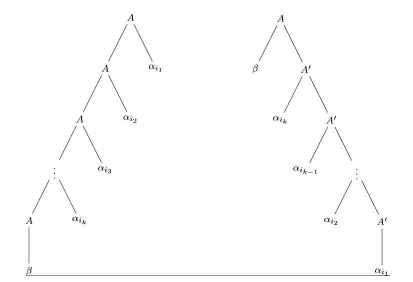

# Resumen para el final de TLeng

## Cosas recontra útiles

### Encontrar la constante de pumping

Para encontrar la constante de pumping de un lenguaje regular, se puede construir un **AFD** $M$ que acepte el lenguaje y luego minimizarlo obteniendo $M'$. Luego, la cantidad de estados de $M'$ es la constante de pumping del lenguaje.

### Cardinalidades

#### AFD

Sea $M = \langle Q, \Sigma, \delta, q_0, F \rangle$ un **AFD**.

- Cantidad de $q_0$ posibles: $|Q|$
- Cantidad de $F$ posibles: $2^{|Q|}$ ($\mathcal{P}(Q)$)
- Cantidad de $\delta$ posibles: $|Q|^{|Q|*|\Sigma|}$ ($\delta : Q \times \Sigma \rightarrow Q$)

#### AFND

Sea $M = \langle Q, \Sigma, \delta, q_0, F \rangle$ un **AFND**.

- Cantidad de $q_0$ posibles: $|Q|$
- Cantidad de $F$ posibles: $2^{|Q|}$ ($\mathcal{P}(Q)$)
- Cantidad de $\delta$ posibles: $2^{|Q|^2*|\Sigma|}$ ($\delta : Q \times \Sigma \rightarrow \mathcal{P}(Q)$)

#### AFND-$\lambda$

Sea $M = \langle Q, \Sigma, \delta, q_0, F \rangle$ un **AFND-$\lambda$**.

- Cantidad de $q_0$ posibles: $|Q|$
- Cantidad de $F$ posibles: $2^{|Q|}$ ($\mathcal{P}(Q)$)
- Cantidad de $\delta$ posibles: $2^{|Q|^2*(|\Sigma|+1)}$ ($\delta : Q \times \Sigma \cup \{\lambda\} \rightarrow \mathcal{P}(Q)$)

#### AP

Sea $M = \langle Q, \Sigma, \Gamma, \delta, q_0, Z_0, F \rangle$ un **AP**.

- Cantidad de $q_0$ posibles: $|Q|$
- Cantidad de $F$ posibles: $2^{|Q|}$ ($\mathcal{P}(Q)$)
- Cantidad de $\delta$ posibles: $2^{|Q|^2*(|\Sigma|+1)*|\Gamma|*|\Gamma^*|}$ ($\delta : Q \times (\Sigma \cup \{\lambda\}) \times \Gamma \rightarrow \mathcal{P}(Q \times \Gamma^*)$)

TODO: chequear $|\Gamma^*|$

### Complejidades

#### Complejidad de construir un AFND a partir de una ER

Sea $r$ una ER. El tamaño $|r|$ se mide por el número de símbolos que contiene, excluidos los paréntesis. Entonces

$|\emptyset | = | \lambda | = |a| = 1, |s + t| = | s \cdot t | = | s | + | t | +1, |s^*| = 1+|s|$.

Denotemos por $n(s)$ el número de estados del autómata $N(s)$. Entonces

$n (\emptyset) = n(\lambda) = n(a) = 2,$

$n(s + t) = n(s)+n(t)+2,$

$n(s \cdot t) = n(s)+n(t)-1,$

$n(s^*) = 2+n(s)$

En todos los casos $n(s) \leq 2|s|$

en otras palabras, el número de estados es como máximo el doble del tamaño de la expresión.

Para el número de transiciones, se aplica un argumento aún más simple: de cada estado salen como máximo dos flechas, por lo que el número de transiciones es como máximo el doble del número de estados.

#### Complejidad de determinizar un AFND

Sea $M = \langle Q, \Sigma, \delta, q_0, F \rangle$ un **AFD**. Sea $n = |Q|$. Entonces, el algoritmo de determinización tiene complejidad $O(2^n)$.

#### Complejidad de minimizar un AFD

Sea $M = \langle Q, \Sigma, \delta, q_0, F \rangle$ un **AFD**. Sea $n = |Q|$, y $s = |\Sigma|$. Entonces, el algoritmo de minimización tiene complejidad $O(ns*log(n))$ (Hopcroft), $O(n^2s)$ (Moore) o $O(2^n)$ (Brzozowski).

#### Complejidad de obtener el complemento de un AFD

Sea $M = \langle Q, \Sigma, \delta, q_0, F \rangle$ un **AFD**. Sea $n = |Q|$. Entonces, el algoritmo de obtener el complemento tiene complejidad $O(n)$.

#### Complejidad de obtener el reverso de un AFD

Sea $M = \langle Q, \Sigma, \delta, q_0, F \rangle$ un **AFD**. Sea $n = |Q|$ y sea $s = |\Sigma|$. La cantidad de transiciones de $M$ en el peor caso es $O(ns)$. Entonces el algoritmo de obtener el reverso tiene complejidad $O(ns)$.

TODO: completar

## Teoremas y algoritmos

### Lema de pumping para lenguajes regulares

#### Lema

Sea $\mathcal{L}$ un lenguaje regular. Existe una constante $c$ tal que para toda cadena $w \in \mathcal{L}$ con $|w| \geq c$, existen cadenas $x, y, z$ tales que $w = xyz$, $|xy| \leq c$, $|y| \geq 1$ y para todo $i \geq 0$, $xy^iz \in \mathcal{L}$.

### Equivalencia AFD y AFND

#### Teorema

Sea $\mathcal{L}$ un lenguaje aceptado por un **AFND**. Existe un **AFD** que acepta $\mathcal{L}$.

#### Prueba

Sea $M = \langle Q, \Sigma, \delta, q_0, F \rangle$ un **AFND** que acepta $\mathcal{L}$.

Construiremos un **AFD**, $M'=\langle Q', \Sigma, \delta', q_0' F' \rangle$ de la siguiente manera:

Los estados de $M'$ serán todos los subconjuntos de $Q$. Es decir, $Q' = \mathcal{P}(Q)$. Cada elemento de $Q'$ será denotado $\{q_1, q_2, \dots, q_n\}$, donde $q_1, q_2, \dots, q_n \in Q$.

Definamos que $q_0' = \{q_0\}$.

Definamos que $F' = \{S \in Q' \mid S \cap F \neq \emptyset\}$. Es decir, $F'$ es el conjunto de todos los estados de $M'$ que contienen al menos un estado final de $M$.

Definamos $\delta'$ de la siguiente manera:

$$\delta'(S, a) = \bigcup_{q \in S} \delta(q, a)$$

Ahora probaremos que $M'$ acepta $\mathcal{L}$.

Sea $\delta^*$ la función de transición extendida de $M$. Es decir, $\delta^*(q, w)$ es el estado al que llega $M$ al leer la cadena $w$ desde el estado $q$.

Veamos que $\delta^*(q_0, w) = \delta'^*(q_0', w)$ por inducción en la longitud de $w$.

*Caso base:*

$|w| = 0 \Rightarrow w = \lambda$.

Luego $\delta^*(q_0, w) = \delta^*(q, \lambda) = \{q\} = q_0' = \delta'^*(q_0', \lambda) = \delta'^*(q_0', w)$.

*Paso inductivo:*
|
$HI$: Supongamos que $\delta^*(q_0, w) = \delta'^*(q_0', w)$ para $|w| \leq m$.

Sea $w = xa$, con $|x| = m$ y $a \in \Sigma$. Entonces:

$\delta'^*(q_0', w) = \delta'^*(q_0', xa) = \delta'(\delta'^*(q_0', x), a) \stackrel{HI}{=} \delta'(\delta^*(q_0, x), a) = \delta'^*(\delta^*(q_0, x), a) \stackrel{HI}{=} \delta^*(\delta^*(q_0, x), a) = \delta^*(q_0, xa) = \delta^*(q_0, w)$.

Luego, $\delta^*(q_0, w) = \delta'^*(q_0', w)$ para todo $w \in \Sigma^*$.

Por lo tanto, $M'$ acepta $\mathcal{L}$. $\square$

### Equivalencia AFND y AFND-$\lambda$

#### Teorema

Sea $\mathcal{L}$ un lenguaje aceptado por un **AFND**-$\lambda$. Existe un **AFND** que acepta $\mathcal{L}$.

#### Prueba

Sea $M = \langle Q, \Sigma, \delta, q_0, F \rangle$ un **AFND**-$\lambda$ que acepta $\mathcal{L}$.

Construiremos un **AFND** $M' = \langle Q, \Sigma, \delta', q_0, F' \rangle$ que acepta $\mathcal{L}$ de la siguiente manera:

Definamos $F' = \left
                    \{
                    \begin{array}{lcc}
                        F\ \cup \{q_0\} & \text{si} & F \in \text{Clausura-}\lambda(q_0) \\ \\
                        F & \text{si no}
                    \end{array}
                \right.$

### Cota para arbol de derivacion en gramática libre de contexto

Página 314 de Aho.

#### Lema

Sea $G = \langle N, \Sigma, P, S \rangle$ una gramática no recursiva a izquierda. Existe una constante $c$ tal que si $A\ \underset{L}{\stackrel{i}{\Rightarrow}}\ wB\alpha$, entonces $i \leq c^{|w|+2}$.

#### Prueba

Sea $\#N = k$, consideremos el árbol de derivación $D$ correspondiente a la derivación más a izquierda de $A\ \stackrel{i}{\Rightarrow}\ wB\alpha$. Supongamos que existe un camino de derivación de largo $k(|w|+2)$ desde la raíz de $D$ hasta un nodo hoja. Sea $n_0$ el nodo que denota a $B$ en $wB\alpha$. Si el camino llega hasta un nodo hoja a la derecha de $n_0$, entonces el camino hasta $n_0$ tiene como mínimo la misma longitud. Esto se debe a que en una derivación más a izquierda el no-terminal más a izquierda siempre se reescribe. Luego, el ancestro directo de cada nodo a derecha de $n_0$ es ancestro de $n_0$.

Entonces, si existe un camino de largo mayor que $k(|w|+2)$ en $D$, podemos encontrar otro camino que alcanza $n_0$ o un nodo a su izquierda. Luego, podemos encontrar $k+1$ nodos consecutivos (llamémoslos $n1, \dots, n_{k+1}$) en ese camino tales que ???????????.

### Definición de recursión a izquierda (derecha)

#### Definición

Sea $G = \langle N, \Sigma, P, S \rangle$ una gramática libre de contexto. Decimos que $G$ es recursiva a izquierda (derecha) si existe un no-terminal $A \in N$ y una cadena $w \in \Sigma^*$ tales que $A \underset{L}{\stackrel{*}{\Rightarrow}}Aw$ ($A \underset{R}{\stackrel{*}{\Rightarrow}}wA$).

### Lema de eliminación de recursión a izquierda

#### Lema

Sea $G = \langle V_N, V_T, P, S \rangle$ una gramática libre de contexto recursiva a izquierda cuyo conjunto de producciones $P$ está dado por:

$$A \rightarrow A\alpha_1 | \dots | A\alpha_m | \dots | \beta_1 | \dots | \beta_n$$

Donde ninguno de los $\beta_i$ empieza con el símbolo $A$ (notar que $G$ es recursiva a izquierda)

Sea $G' = \langle V_N \cup \{A'\}, V_T, P', S \rangle$ una gramática libre de contexto con $A'$ un nuevo símbolo no-terminal y $P'$ idéntico a $P$ pero reemplazando cada producción que tiene a $A$ como cabeza por:

$$A\rightarrow \beta_1 | \dots | \beta_n | \beta_1 A' | \dots | \beta_n A'$$
$$A'\rightarrow \alpha_1 | \dots | \alpha_m | \alpha_1 A' | \dots | \alpha_m A'$$

La gramática $G'$ no es recursiva a izquierda y genera el mismo lenguaje que $G$.

#### Demostración

Notar que en la gramática $G$, las cadenas que se pueden obtener mediante una derivación más a la izquierda, con producciones que tengan como cabeza a $A$, están representadas por un conjunto regular que se puede expresar con la siguiente expresión regular:

$$(\beta_1 | \beta_2 | ... | \beta_n) (\alpha_1 | \alpha_2 | ... | \alpha_m)^*$$

Esas cadenas son exactamente las mismas que las que se pueden obtener mediante una derivación más a la derecha usando una sola producción con cabeza $A$, y el resto con cabeza $A'$, en la gramática $G'$ (la derivación resultante deja de ser más a la izquierda).

Todos los pasos de la derivación en $G$ que no utilizan una producción con cabeza $A$ se pueden hacer también en $G'$ (ya que esas producciones se mantienen inalteradas). Luego, se concluye que $L(G') \subseteq L(G)$.

Recíprocamente, se puede usar un razonamiento análogo para afirmar que: una derivación en $G$ se supone más a la derecha, y se consideran secuencias de usar una única producción con cabeza $A$, y el resto con cabeza $A'$. En conclusión, $L(G') = L(G)$.

#### Observación

$P'$ tiene a lo sumo el doble de producciones que $P$. Es decir, el algoritmo de eliminación de la recursión a izquierda duplica las producciones en el peor caso. En cuanto a la complejidad, esta es lineal en $|P|$ (el algoritmo recorre cada producción una única vez).

### Algoritmo de eliminación de recursión a izquierda

#### Inmediata

- **Entrada**: $G = \langle V_N, V_T, P, S \rangle$ gramática libre de contexto, sin producciones borradoras, símbolos inútiles ni ciclos.
- **Salida**: $G'$ gramática libre de contexto, sin recursión inmediata a izquierda, tal que $L(G) = L(G')$.
- **Procedimiento**: sea $n = |V_N|$. Numerar los símbolos no terminales $A_1, A_2, ..., A_n$, iterar sobre $i = 1, 2, ..., n$, y en el paso $i$ transformar las producciones con cabeza $A_i$, como en el lema anteriormente mencionado.
- **Invariante del ciclo**: todas las producciones con cabeza $A_k$, para $k = 1, ..., i − 1$, fueron posiblemente transformadas a $A_k \rightarrow \alpha$, donde $\alpha$ empieza con un símbolo terminal, o un símbolo no terminal $A_l$, con $l > k$.

#### No inmediata

- **Entrada**: $G = \langle V_N, V_T, P, S \rangle$ gramática libre de contexto, sin producciones borradoras, símbolos inútiles ni ciclos.
- **Salida**: $G'$ gramática libre de contexto, sin recursión a izquierda, tal que $L(G) = L(G')$.
- **Procedimiento**: sea $n = |V_N|$. Numerar los símbolos no terminales $A_1, A_2, ..., A_n$. Modificar $G$ hasta obtener $G'$ donde para cada producción $A_k \rightarrow \alpha$, $\alpha$ empieza con un símbolo terminal, o un símbolo no terminal $A_l$, con $l > k$.
- **Complejidad**: sea $c$ la máxima cantidad de producciones con la misma cabeza. En el peor caso, se tiene:
  - Todas las producciones de $G$ con cabeza $A_1$ tienen recursión inmediata a izquierda.
    Al transformarlas, pasan a ser $2c$ producciones con cabeza $A_1$ en $G'$.
  - Todas las producciones de $G$ con cabeza $A_2$ tienen cuerpo que empieza con $A_1$. Al transformarlas, pasan a ser $2 * 2c * c = (2c)^2$ producciones con cabeza $A_2$ en G'.
  - Todas las producciones de $G$ con cabeza $A_3$ tienen cuerpo que empieza con $A_1$. Al transformarlas, pasan a ser $2c * 2c * (2c)^2 = (2c)^4$ producciones con cabeza $A_3$ en G'.
  - Todas las producciones de $G$ con cabeza $A_4$ tienen cuerpo que empieza con $A_1$. Al transformarlas, pasan a ser $2c * 2c * (2c)^2 * (2c)^4 = (2c)^8$ producciones con cabeza $A_4$ en $G'$.
  - ...
  - Todas las producciones de $G$ con cabeza $A_n$ tienen cuerpo que empieza con $A_1$. Al transformarlas, pasan a ser

    $$2c * \prod_{i=0}^{n-1} (2c)^{2^i} = 2c * (2c)^{2^0+2^1+...+2^n−1} = 2c * (2c) {2^n−1} = (2c)^{2n}$$

    producciones con cabeza $A_n$ en $G'$.
  - Por lo tanto, en peor caso $G'$ tiene menos que $2 * (2c)^{2^n}$ producciones.

#### Completo

- **Entrada**: $G = \langle V_N, V_T, P, S \rangle$ gramática libre de contexto, sin producciones borradoras, símbolos inútiles ni ciclos.
- **Salida**: $G'$ gramática libre de contexto, sin recursión a izquierda, tal que $L(G) = L(G')$.
- **Algrotimo**:

##### Observación

La performance de este algoritmo varía considerablemente con la elección del
orden para la enumeración de los símbolos no terminales $A_1, A_2, ..., A_n$.

### Algoritmo para pasar a forma normal de Chomsky

